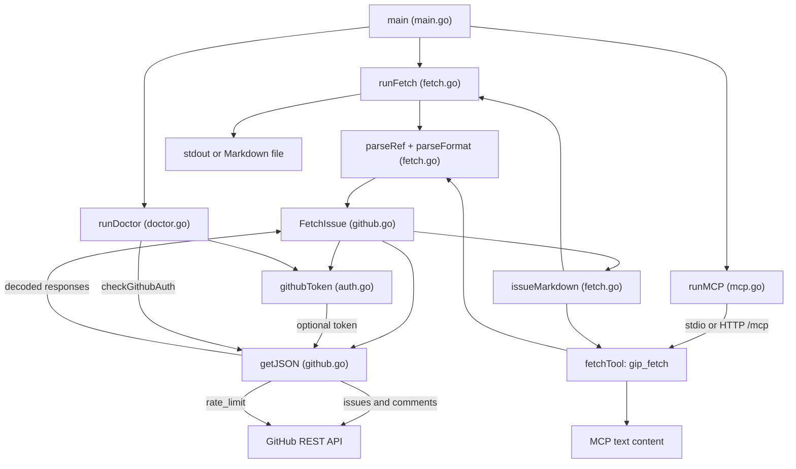

# Architecture

GIP is a single-package Go CLI. `main` in `main.go` dispatches to `runFetch`,
`runDoctor`, or `runMCP`. There is no separate service or storage layer.

`runFetch` parses a repository issue/PR reference and the requested sections,
calls `FetchIssue`, then renders the result with `issueMarkdown` to stdout or
a file. `runMCP` uses the Go MCP SDK to serve `gip_fetch` over stdio or
Streamable HTTP at `/mcp`; its `fetchTool` uses the same parsing, fetching,
and rendering functions.

`FetchIssue` in `github.go` reads an optional token through `githubToken` in
`auth.go`. It uses `getJSON` to call GitHub's issues and comments REST
endpoints, then assembles an `Issue` for the Markdown renderer. Public
repositories can be fetched without a token. `runDoctor` requires a token
and checks it with an authenticated `/rate_limit` request through `getJSON`.
`githubToken` prefers `GIP_GITHUB_TOKEN` over `GITHUB_TOKEN`.

