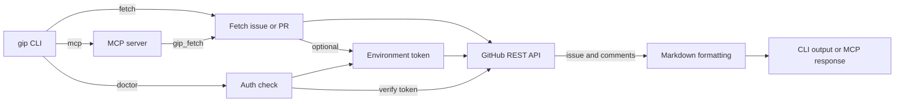

# Architecture

GIP is a single-package Go CLI. `main` dispatches to `fetch`, `doctor`, or
`mcp`. The CLI and MCP interfaces share the same issue/PR fetching and
Markdown formatting flow.

`fetch` parses a repository issue/PR reference and requested sections.
`FetchIssue` retrieves the issue or PR and its comments from the GitHub REST
API; `issueMarkdown` turns the result into Markdown for stdout or a file.
The `mcp` command exposes that flow as `gip_fetch` over stdio or HTTP.

The auth layer reads `GIP_GITHUB_TOKEN`, falling back to `GITHUB_TOKEN`.
Fetching public repositories works without a token. `doctor` requires one
and checks it against GitHub's `/rate_limit` endpoint.

